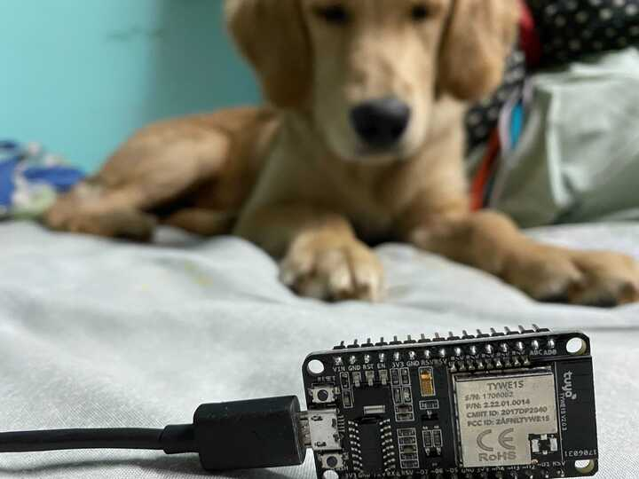

esp8266tool
==

Toy program to communicate with the Espressif ESP8266 bootloader.



Based on [esptool](https://github.com/fluepke/esptool) and [esptool.py](https://github.com/espressif/esptool).

Currently the only supported command is `read_mac`:

```
% ./esp8266tool --port=/dev/cu.usbserial-1410 read_mac
2021/01/07 00:15:40 Trying to establish connection with the device
2021/01/07 00:15:40 Connection established with /dev/cu.usbserial-1410, baud rate is 115200
2021/01/07 00:15:40 SYNC ok
2021/01/07 00:15:40 MAC address is: 5c:cf:7f:b9:d5:f4
```

TODO/ideas
==

- Integrate ESP8266 support into [esptool](https://github.com/fluepke/esptool).
- Implement **flash** commands